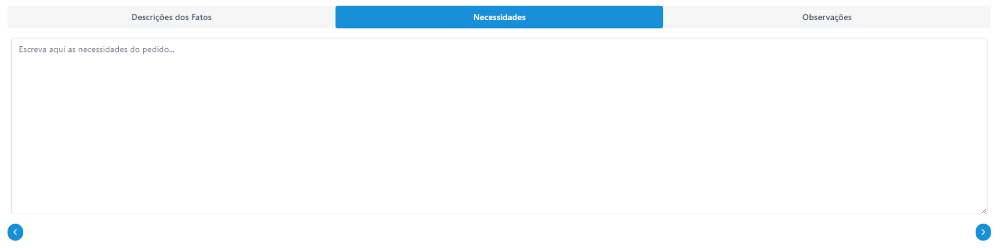
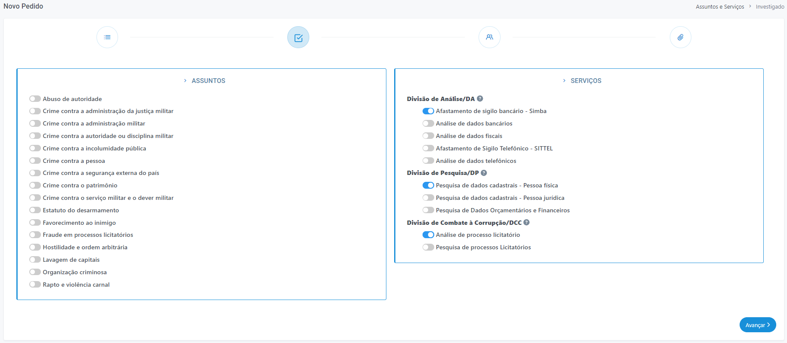
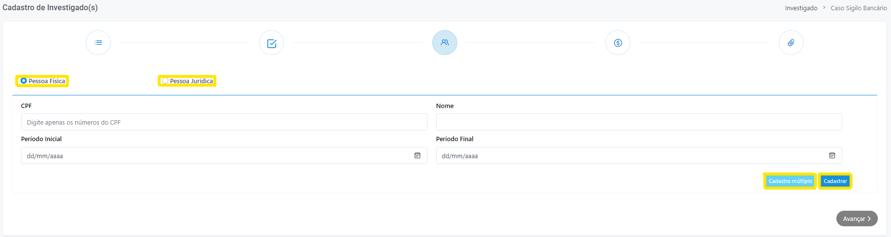
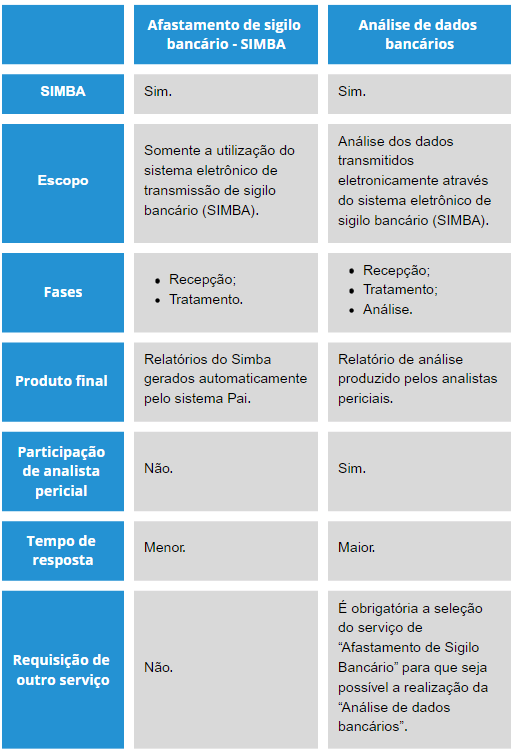
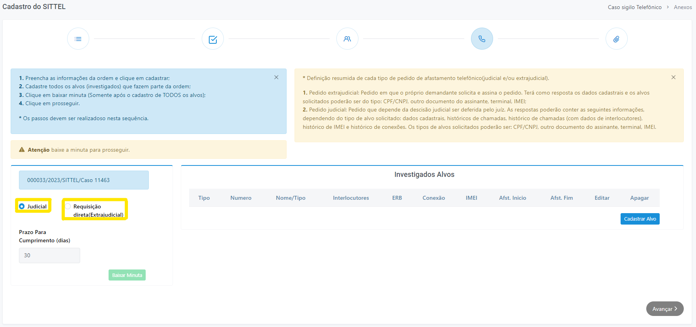
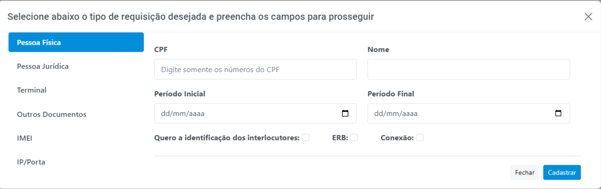
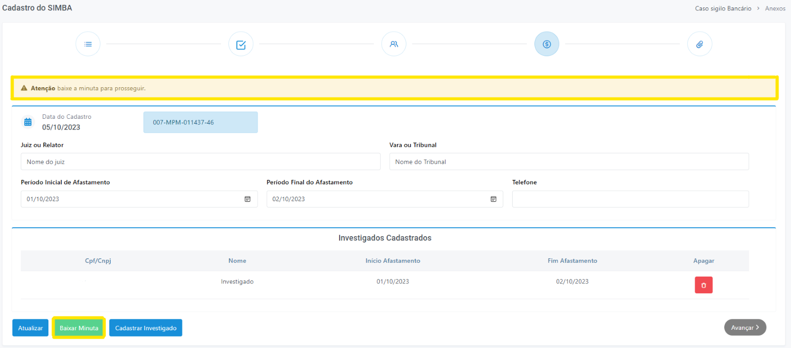

# Criando novo pedido 

1 Clique sobre o botão <strong>"Novo pedido", </strong> localizado no menu lateral esquerdo.

2 Em seguida, será aberta a página contendo um formulário de preenchimento, intitulado “Cadastro do Pedido” (Figura 5).

*Figura 5 - Cadastro do Pedido*.   

Preencha o campo nome, selecione qual a classe de feitos deste caso e digite o número do procedimento. Caso existam pedidos com o mesmo número de procedimento, o PAI apresentará uma tabela listando estes pedidos (Figura 6) e seus respectivos detalhes.    

A partir disto, caso existam pedidos que possuam vínculo com o pedido que está sendo cadastrado, selecione-os, clicando nos <svg xmlns="http://www.w3.org/2000/svg" viewBox="0 0 24 24" width="20" height="20" style="vertical-align: middle;"><rect width="18" height="18" x="3" y="3" rx="5" ry="5" fill="none" stroke="currentColor" stroke-width="2"/></svg>. Essa indicação tornará o trabalho de análise mais célere.    

Por fim, o campo "Origem" do pedido é automaticamente selecionado pelo PAI, de acordo com a lotação do membro que está cadastrando o novo pedido. Porém, caso seja de interesse, é possível alterar este campo de acordo com a lotação desejada. 

*Figura 6 - Pedido com mesmo número de procedimento*.   

##  Campo "Descrição dos Fatos"

Entende-se que o membro solicitante é o detentor das informações mais relevantes do procedimento investigatório. Por essa razão, a contextualização do caso por parte da autoridade é extremamente importante e deve ser feita de forma a subsidiar os analistas com informações preponderantes para análise do pedido.

*Figura 7 - Descrição dos fatos*.   

##  Campo "Necessidades"

O preenchimento deste campo, com o serviço pretendido, permite a SPAI delimitar o escopo do trabalho dos analistas.    É neste campo que o membro deverá descrever da forma mais objetiva possível o que se espera da análise solicitada, indicando os quesitos que se pretende responder para a sustentação da tese de forma a otimizar a alocação dos recursos humanos da SPAI para o atendimento das necessidades descritas e o atingimento do objetivo pretendido de modo mais eficiente e célere.

*Figura 8 - Necessidades*.   

##  Assuntos e Serviços 

3 Em seguida, na página "Novo pedido", selecione os assuntos e os serviços desejados (Figura 9) clicando sobre os ícones <svg xmlns="http://www.w3.org/2000/svg" viewBox="0 0 576 512" width="20" height="20" style="vertical-align: middle;" ><!--! Font Awesome Pro 6.4.2 by @fontawesome - https://fontawesome.com License - https://fontawesome.com/license (Commercial License) Copyright 2023 Fonticons, Inc. --><path d="M384 128c70.7 0 128 57.3 128 128s-57.3 128-128 128H192c-70.7 0-128-57.3-128-128s57.3-128 128-128H384zM576 256c0-106-86-192-192-192H192C86 64 0 150 0 256S86 448 192 448H384c106 0 192-86 192-192zM192 352a96 96 0 1 0 0-192 96 96 0 1 0 0 192z" fill="currentColor" d="m21.68 17.65l-7-14a3 3 0 0 0-5.36 0l-7 14a3 3 0 0 0 3.9 4.08l5.37-2.4a1.06 1.06 0 0 1 .82 0l5.37 2.4a3 3 0 0 0 3.9-4.08Zm-2 2a1 1 0 0 1-1.13.22l-5.37-2.39a3 3 0 0 0-2.44 0L5.41 19.9a1 1 0 0 1-1.3-1.35l7-14a1 1 0 0 1 1.78 0l7 14a1 1 0 0 1-.17 1.13Z"/></svg>. Ao finalizar, clique em "Avançar". 

*Figura 9 - Selecionar Assuntos e Serviços*.   

 Escolha o serviço de acordo com o assunto e as necessidades apontadas no campo específico “necessidades”.   
Na formulação de um novo pedido, além do campo necessidades, há uma lista de assuntos e outra de serviços. Essa segregação é importante, pois os pedidos recebidos na SPAI passam por uma triagem eletrônica, feita pelo próprio sistema, que coloca cada pedido em filas diferentes de acordo com critérios bem definidos (serviço escolhido, assunto, grau de complexidade, etc).    Dessa forma, é de suma importância que o serviço, o assunto e as necessidades estejam em sintonia, para que o atendimento dos pedidos seja otimizado. Some-se a isso, o fato de que a combinação correta desses três itens permite delimitar e orientar a análise, auxiliando na definição do escopo do trabalho dos analistas. 

<strong>Serviços</strong>

*Figura 10 - Serviços*.   

####  Afastamento de Sigilo Bancário - SIMBA 

<strong>Descrição do serviço: </strong> cadastramento de caso para afastamento de sigilo bancário, bem como, recepção, higienização e disponibilização dos dados transmitidos pelo Banco Central e pelas instituições financeiras ao demandante.    Esta opção acionada isoladamente NÃO gera análise de dados bancários, mas tão somente a disponibilização dos dados ao solicitante, após tratamento.   <strong>Unidade prestadora:</strong> Seção de Tratamento de Dados Sigilosos.   <strong>Entregas: </strong>Resumo do trabalho de tratamento de dados bancários do caso.   <strong>Produto:</strong> 
<ul>
<li style="text-align: justify"><i>Relatório de Pendências:</i> para cobranças aos bancos em mora. </li>
<li style="text-align: justify"><i>Relatório de Identificação de Operações Bancárias:</i> para cobranças de identificação dos depositantes e beneficiários de operações financeiras. </li>
<li style="text-align: justify"><i>Relatório de Respostas às Diligências:</i> para atestar quais diligências foram cumpridas pelas instituições financeiras. </li>
<li style="text-align: justify"><i>Relatório de Validação de Dados:</i> para atestar que os dados foram transmitidos e tratados de acordo com parâmetros mínimos de aceitabilidade. </li>
</ul>

 

####  Análise de Dados Bancários 

<strong>Descrição do serviço: </strong> são realizadas análises de dados bancários em relação a pessoas físicas e/ou jurídicas investigadas, observados os limites da decisão judicial autorizativa, assim como as necessidades relatadas no PAI, sobretudo em relação à hipótese investigativa formulada pelo membro solicitante, no intuito de identificar indícios ou provas que subsidiem a investigação.   <strong> Unidade prestadora:</strong> Divisão de Análise   <strong>Entregas: </strong>A análise de dados bancários descreve o volume, a compatibilidade e a natureza das transações financeiras dos investigados, buscando relacionar os principais envolvidos, inclusive identificando graus de relacionamento com integrantes das FFAA e/ou com empresas investigadas com quem o Poder Público contrate.   <strong>Produto:</strong> 
<ul>
<li style="text-align: justify"><i>Relatório de Análise - RA</i></li>
</ul>

 

####  Análise de Dados Fiscais 

<strong>Descrição do serviço: </strong> são realizadas análises de dados fiscais em relação a pessoas investigadas, observados os limites da decisão judicial autorizativa, assim como as necessidades relatadas no PAI, sobretudo em relação à hipótese investigativa formulada pelo Membro solicitante, no intuito de encontrar indícios ou provas que subsidiem a investigação. A ênfase reside na verificação da evolução patrimonial dos investigados e sua compatibilidade com os rendimentos/proventos recebidos e/ou declarados.   <strong>Unidade prestadora:</strong> Divisão de Análise   <strong>Entregas: </strong>Análise da evolução patrimonial dos investigados no período delimitado pelo afastamento de sigilo. Análise de compatibilidade dessa evolução em relação aos rendimentos declarados. Na hipótese de também haver análise dos dados bancários, faz-se o cotejo entre os dados bancários e os dados fiscais declarados ou apurados pela RFB.   <strong>Produto:</strong> 
<ul>
<li style="text-align: justify"><i>Relatório de Análise - RA </i></li>
</ul>

 

####  Afastamento de Sigilo Telefônico - SITTEL 

<strong>Descrição do serviço: </strong>  cadastramento de caso para afastamento de sigilo telefônico, bem como, recepção, higienização e disponibilização dos dados transmitidos pelas operadoras de telefonia para realização de análise.     A seleção desse serviço aciona automaticamente o serviço de Análise de Dados Telefônicos.    Cabe ressaltar que não se trata de escuta telefônica ou de leitura de mensagens, ações estas que dependem também da autorização judicial para que autoridade policial efetue interceptações, tampouco de descriptografia de aparelhos telefônicos para extração de imagens, dados, etc – atribuições típicas de polícia judiciária, que requer tecnologia e expertise apropriadas.   <strong>Unidade prestadora:</strong> Seção de Tratamento de Dados Sigilosos   <strong>Entregas: </strong>Resumo do trabalho de tratamento dos dados telefônicos do caso.   <strong>Produto:</strong> 
<ul>
<li style="text-align: justify"><i>Informação de Sigilo Telefônico:</i> atesta a situação do caso no fluxo de afastamento de sigilo telefônico. </li>
</ul>

 

####  Análise de Dados Telefônicos 

<strong>Descrição do serviço: </strong>  são realizadas análises dos dados telefônicos em relação aos alvos da investigação (CPF, CNPJ, terminal, IMEI, etc), observados os limites da decisão judicial autorizativa, assim como as necessidades relatadas no PAI, sobretudo em relação à hipótese investigativa formulada pelo membro solicitante, no intuito de identificar indícios ou provas que subsidiem a investigação por meio da obtenção de dados cadastrais de alvos, relacionando-se ligações, mensagens e vínculos entre investigados ou envolvidos, evidenciando o volume de contatos realizados em momentos específicos que sejam relevantes para a investigação, bem como, a colocação de alvos em determinada área, por meio de recursos de geolocalização.   <strong>Unidade prestadora:</strong> Divisão de Análise   <strong>Entregas: </strong>A análise de dados telefônicos descreve dados cadastrais, habitualidade, constância, recorrência e duração de contatos telefônicos através de ligações ou mensagens de textos, entre os números investigados, bem como, a geolocalização de alvos em determinado momento.   <strong>Produto:</strong> 
<ul>
<li style="text-align: justify"><i>Relatório de Análise - RA </i></li>
</ul>

 

####  Análise de Processos Licitatórios 

<strong>Descrição do serviço: </strong>  São analisadas as informações constantes na documentação enviada ou obtidas em fontes abertas e sistemas corporativos disponíveis sobre determinados militares ou empresas contratadas pela Administração Pública Federal, no intuito de identificar ilicitudes existentes e potenciais em procedimentos de contratação pública realizadas por unidades militares.    Não se trata de análise jurídica, mas descritiva acerca do processo licitatório, evidenciando fatos atípicos ou suspeitos.   <strong>Unidade prestadora:</strong>  Divisão de Combate à Corrupção.   <strong>Entregas: </strong> Análise do processo licitatório, a partir de consultas aos sistemas do Governo Federal disponíveis, realizando abordagem quanto a:  
<ul>
<li style="text-align: justify"><i> Regularidade do fluxo licitatório; <i></li>
<li style="text-align: justify"><i> Análise de preços praticados; <i></li>
<li style="text-align: justify"><i> Apresentação do volume de valores empenhados, liquidados e pagos; <i></li>
<li style="text-align: justify"><i> Identificação das licitantes vencedoras;  <i></li>
<li style="text-align: justify"><i> Verificação da inabilitação de propostas mais vantajosas;  <i></li>
<li style="text-align: justify"><i> Apontamento de indícios de favorecimento de licitantes. <i></li>
</ul><strong>Produto:</strong> 
<ul>
<li style="text-align: justify"><i>Relatório de Análise. </i></li>
</ul>

 

####  Pesquisa de Dados Orçamentários e Financeiros 

<strong>Descrição do serviço: </strong>  São informados pontualmente dados acerca de quesitos formulados pelo demandante, tais como: “Com quais unidades militares a empresa X contratou no ano de 2018?”, “Verificar se empresa X contratou com a UASG Y no período de 2016 a 2018”, “Qual o montante homologado, empenhado, liquidado e pago pela unidade militar Y à empresa X no ano de 2020?”.   <strong>Unidade prestadora:</strong>  Divisão de Combate à Corrupção.   <strong>Entregas: </strong>Identifica os dados solicitados.   <strong>Produto:</strong> 
<ul>
<li style="text-align: justify"><i>Relatório de Pesquisa. </i></li>
</ul>

 

####  Pesquisa de Processos Licitatórios 

<strong>Descrição do serviço: </strong>  São informados pontualmente dados acerca de quesitos formulados pelo demandante, tais como: “A empresa X concorreu em pregões da unidade militar Y no ano de 2022?”, “Verificar se empresa X venceu itens de licitações da UASG Y no período de 2016 a 2018”?”.   <strong>Unidade prestadora:</strong>  Divisão de Combate à Corrupção.   <strong>Entregas: </strong>Identifica os dados solicitados.   <strong>Produto:</strong> 
<ul>
<li style="text-align: justify"><i>Relatório de Pesquisa. </i></li>
</ul>

 

####  Pesquisa de Dados Cadastrais 

<strong>Descrição do serviço: </strong>  são realizadas pesquisas em relação a pessoas físicas e/ou jurídica investigadas, em bases de dados abertas e fechadas, firmadas por meio de convênio, observadas as necessidades relatadas no PAI, sobretudo em relação à hipótese investigativa formulada pelo Membro solicitante, no intuito de encontrar indícios ou provas que subsidiem a investigação.   <strong>Unidade prestadora:</strong>  Divisão de Pesquisa.   <strong>Entregas: </strong>Qualifica a pessoa física e/ou jurídica investigada.    No caso de Pessoa Física, são apontados os dados encontrados nas bases: endereço, telefone, filiação, data de nascimento, título de eleitor, foto (se disponível), vínculo empregatício e societário. Em caso de necessidade, são encaminhados endereços de genitores e irmãos da pessoa física pesquisada.    Além disso, quando necessário, identificam-se fontes de pesquisa de óbito, indicando data, quando for o caso.    No caso de Pessoa Jurídica, informa-se o endereço da empresa, nome fantasia, data de constituição, quadro societário e, quando for o caso, seu histórico, entre outras informações.    Se necessário é elaborado diagrama de vínculos para melhor visualização dos resultados encontrados.   <strong>Produto:</strong> 
<ul>
<li style="text-align: justify"><i>Relatório de Pesquisa. </i></li>
</ul>

## Investigados

4 Na página seguinte, será disponibilizado um formulário para preenchimento das informações conhecidas pelo demandante acerca do(s) investigado(s) do pedido. Caso o pedido solicite <strong>serviços de Divisão de Análise</strong>, o formulário solicitará o preenchimento dos campos CPF/CNPJ, Nome, Período Inicial e Período Final, conforme ilustrado a seguir:

*Figura 11 - Cadastro de investigado(s)*.   

Caso o pedido solicite <strong>serviços de Divisão de Pesquisa</strong> e/ou <strong>serviços de Divisão de Combate à Corrupção</strong>, o formulário solicitará apenas o preenchimento dos campos CPF/CNPJ e Nome, conforme ilustrado a seguir:

.png)
*Figura 12 - Cadastro de investigado(s)*.   

<svg height="35px" width="25px" style="vertical-align: middle" version="1.1" id="Layer_1" xmlns="http://www.w3.org/2000/svg" xmlns:xlink="http://www.w3.org/1999/xlink" viewBox="0 0 511.999 511.999" xml:space="preserve" fill="#000000" stroke="#000000"><g id="SVGRepo_bgCarrier" stroke-width="0"></g><g id="SVGRepo_tracerCarrier" stroke-linecap="round" stroke-linejoin="round"></g><g id="SVGRepo_iconCarrier"> <path style="fill:#F5C525;" d="M16.242,429.476L232.332,55.195c10.518-18.219,36.814-18.219,47.333,0l216.091,374.281 c10.518,18.219-2.63,40.991-23.666,40.991H39.908C18.872,470.467,5.723,447.695,16.242,429.476z"></path> <g><path style="fill:#EFEFEF;" d="M255.999,322.45L255.999,322.45c-14.172,0-25.66-11.488-25.66-25.66V172.87 c0-14.172,11.488-25.66,25.66-25.66l0,0c14.172,0,25.66,11.488,25.66,25.66v123.92C281.659,310.962,270.171,322.45,255.999,322.45z "></path><circle style="fill:#EFEFEF;" cx="256.001" cy="397.558" r="25.034"></circle></g><g><path style="fill:#231F20;" d="M506.597,423.218L290.506,48.937C283.304,36.462,270.404,29.014,256,29.014 c-14.404,0-27.304,7.448-34.506,19.922L5.402,423.218c-7.202,12.475-7.202,27.37,0,39.845 c7.202,12.475,20.103,19.922,34.507,19.922h432.183c14.405,0,27.305-7.448,34.507-19.922 C513.799,450.588,513.799,435.692,506.597,423.218z M484.917,450.545c-1.286,2.227-5.108,7.405-12.826,7.405H39.908 c-7.718,0-11.541-5.178-12.826-7.405c-1.286-2.227-3.859-8.126,0-14.81L243.172,61.454c3.859-6.683,10.255-7.405,12.826-7.405 s8.967,0.722,12.826,7.405l216.091,374.281C488.775,442.419,486.201,448.318,484.917,450.545z"></path><path style="fill:#231F20;" d="M255.999,134.692c-21.051,0-38.177,17.126-38.177,38.177v123.92 c0,21.051,17.126,38.178,38.177,38.178s38.177-17.126,38.177-38.177V172.87C294.176,151.818,277.05,134.692,255.999,134.692z M269.142,296.79c0,7.247-5.896,13.143-13.143,13.143s-13.143-5.896-13.143-13.143V172.87c0-7.247,5.896-13.143,13.143-13.143 s13.143,5.896,13.143,13.143V296.79z"></path><path style="fill:#231F20;" d="M255.999,360.002c-20.706,0-37.552,16.846-37.552,37.552c0,20.706,16.846,37.552,37.552,37.552 s37.552-16.846,37.552-37.552C293.55,376.848,276.705,360.002,255.999,360.002z M255.999,410.071 c-6.902,0-12.517-5.615-12.517-12.517c0-6.902,5.615-12.517,12.517-12.517s12.517,5.615,12.517,12.517 C268.516,404.455,262.901,410.071,255.999,410.071z"></path></g></g></svg>
Para cadastrar vários investigados de uma vez só, basta clicar no botão <strong>"Cadastro múltiplo"</strong>, separando os números de CPF/CNPJ por vírgula.

O processo poderá ser repetido enquanto houver investigados a serem cadastrados. Todos os investigados serão incluídos em série na tabela.    É possível, também, através da tabela, editar e excluir dados já cadastrados. O cadastramento de investigados também é aproveitado para outros serviços selecionados dentro da plataforma. 
 

##  Afastamento de Sigilio Bancário SIMBA 

<strong> Caso seja solicitado o serviço “Afastamento de Sigilo Bancário Simba” </strong>, o sistema solicitará que o usuário preencha os campos referentes aos dados gerais do afastamento de sigilo bancário a ser requerido ao Juiz (Figura 13). 

*Figura 13 - Cadastro Afastamento de Sigilo Bancário*.   

  Diferença entre serviço de "Afastamento de sigilo bancário" e "Análise de dados bancários" : 

  
*Figura 14 - Cadastro Afastamento de Sigilo Bancário*.   

Uma exigência do sistema para pedidos com o serviço de afastamento de sigilo é o <strong> download da minuta </strong>, passo este que é obrigatório para o prosseguimento do processo de cadastro por meio do botão “Baixar minuta”.

 <strong>Não copie e cole a minuta!</strong> A ação de copiar e colar, comumente utilizada pelos usuários, pode gerar grandes transtornos ao trâmite do afastamento de sigilo bancário via SIMBA. Por exemplo, se o número do caso for incorretamente informado, irá causar uma série de problemas, como:   
    - Os dados bancários transmitidos cairão em outro caso;  
    - Contamina a prova;  
    - Acaba por evidenciar dados de outro caso guardado por sigilo;  
    - Impossibilita o controle dos dados que deverão ser transmitidos pelos Bancos, inviabilizando, por conseguinte, eventuais cobranças de mora;  
    - Causa ruídos de comunicação entre a SPAI, o Judiciário, o BACEN e as instituições financeiras;   
    - Possibilita que as instituições financeiras aleguem o não recebimento de nenhuma determinação do Banco Central para transmitir eventuais dados pendentes.   

Caso ocorra o envio do PQS ao Judiciário com um número de caso incorreto, assim que detectado o equívoco, será necessária a reiteração do pedido à autoridade judiciária. O membro deverá refazer o pedido, gerar nova minuta (com novo número) e reiterar o pedido ao Juiz, sendo que esse trâmite poderá causar uma excessiva demora até a análise do caso.   

Por fim, sugerimos que a minuta seja utilizada como anexo do PQS! 

 

##  Afastamento de sigilo telefônico - SITTEL 

O SITTEL é um sistema de investigação de registros telefônico e telemático, tendo sido desenvolvido para recebimento e processamento de dados decorrentes de afastamento de sigilo de registros de telefone autorizado pela Justiça.    Pelo sistema, é possível transmitir as ordens judiciais e ofícios requisitórios (ofício extrajudicial) diretamente para as operadoras de telefonia, por meio tecnológico seguro. O SITTEL não realiza interceptação telefônica e nem afastamento do sigilo telemático. 

 Assim, <strong>caso o usuário tenha cadastrado um pedido selecionando o serviço “Afastamento de sigilo telefônico - SITTEL” </strong>, será redirecionado para a tela de formulário de “cadastro do SITTEL”. Nela, é necessário informar qual o tipo de solicitação desejada, "Judicial" ou "Requisição direta (Extrajudicial)" (Figura 15).

 <ul>
    <li style="text-align: justify;"><strong>Pedido judicial:</strong> pedido que depende da decisão judicial ser proferida pelo juíz. As respostas poderão conter as seguintes informações, dependendo do tipo de alvo solicitado: dados cadastrais, históricos de chamadas, histórico de chamadas (com dados de interlocutores), histórico de IMEI e histórico de conexões. Os tipos de alvos solicitados poderão ser: pessoa física; pessoa jurídica; terminal; outros documentos (passaporte, RG, RNE); IMEI (Identificação Internacional de Equipamento Móvel); ERB (Estação Rádio Base); Localização (a partir da Latitude e Longitude); Endereço e IP/Porta.   </li>
    <li style="text-align: justify;"><strong> Pedido extrajudicial: </strong> pedido em que o próprio demandante solicita e assina a requisição. Terá como resposta os dados cadastrais e IMEI. Os alvos solicitados poderão ser do tipo: pessoa física; pessoa jurídica; terminal; outros documentos (passaporte, RG, RNE); IMEI (Identificação Internacional de Equipamento Móvel); ERB (Estação Rádio Base); Localização (a partir da Latitude e Longitude); Endereço e IP/Porta.  </li> 
 </ul>

*Figura 15 - Formulário de "Cadastro do SITTEL"*.   

Ao clicar em cadastrar alvo, uma modal (janela na página) será aberta (Figura 16) e o usuário poderá escolher qual quebra de sigilo deseja: CPF/CNPJ, Terminal, “Outros tipos de documentos” (passaporte, RNE...), IMEI (Identificação Internacional de Equipamento Móvel) e IP/Porta.   

Além disso, também é possível requerer informações adicionais de interlocutores (pessoas que tiveram interações telefônicas com o investigado), dados de ERB (informações relacionadas a uma Estação Rádio Base, possibilitando saber à qual torre telefônica o investigado estava conectado) e de histórico de conexões.   

Uma exigência do sistema para pedidos com o serviço de afastamento de sigilo é o <strong> download da minuta </strong>, passo este que é obrigatório para o prosseguimento do processo de cadastro por meio do botão “Baixar minuta” (Figura 17). 

*Figura 16 - Modo de seleção de tipo de requisição*.   

*Figura 17 - Baixar minuta*.   

5 Por fim, é disponibilizada a página que possibilita a inclusão de arquivos (Upload) no pedido e o botão “Finalizar” para a conclusão do cadastro do novo pedido, conforme figura a seguir (Figura 18): 

*Figura 18 - Upload de Arquivos*.   

##  Pedido pronto

Pedidos feitos por meio do PAI são categorizados pelo próprio sistema, não havendo ingerência humana nesse processo. Essa categorização é feita de acordo com regras predeterminadas e baseiam-se nos serviços que foram escolhidos pelo membro, gerando filas de pedidos que são rigorosamente obedecidas.   

Além das filas de pedidos, a disponibilidade de analista, a complexidade do(s) serviço(s) solicitado(s) e a complexidade do caso impossibilitam o estabelecimento de uma data precisa sobre o término da análise do pedido.   

Quando o trabalho da SPAI é terminado e o pedido concluído, o membro demandante receberá e-mail automático do sistema informando sobre a conclusão do trabalho e a disponibilização do relatório respectivo. 
 
