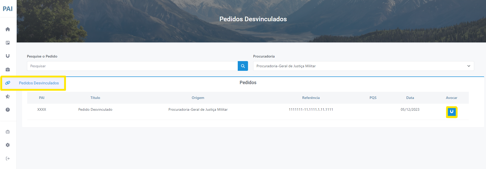

# Pedidos Desvinculados

Permite ao membro visualizar os pedidos dos quais se desvinculou e, se desejar, restabelecer o vínculo. Para isso, basta pesquisar o pedido desejado e clicar no botão "Avocar" (Figura 46).

*Figura 46 - Aba de pedidos desvinculados*.   

 Uma janela será aberta solicitando que o membro justifique o motivo para a avocação. Basta descrever o motivo e clicar em "Avocar" (Figura 47)

 
*Figura 47 - Justificar avocação*.   