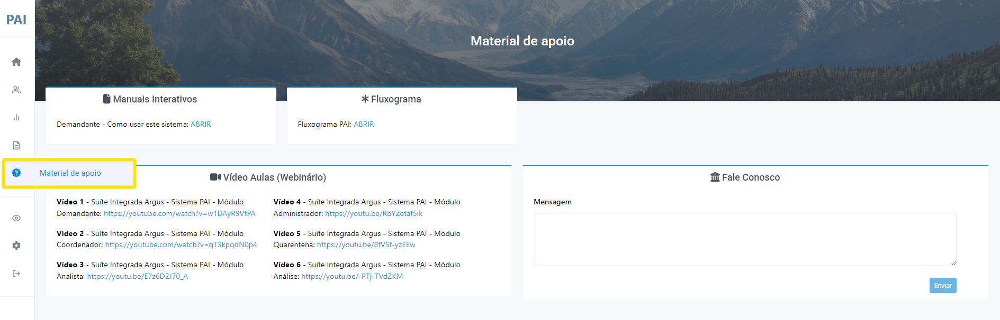

# Material de Apoio

Nesta aba é possível acessar recursos que auxiliam no uso do sistema (Figura 49). Dentre as ferramentas disponíveis estão: 

<ul>
<li>Manual do sistema Pai Cloud</li>
<li>Fluxograma Pai Cloud</li>
<li>Vídeo Aulas (Webinário)</li>
</ul>

 
*Figura 49 - Material de Apoio*.   

Também é possível entrar em contato com a equipe de desenvolvimento tecnológico do sistema Pai Cloud para obter maiores esclarecimentos (Figura 50). 

 
*Figura 50 - Suporte Fale Conosco*.   
