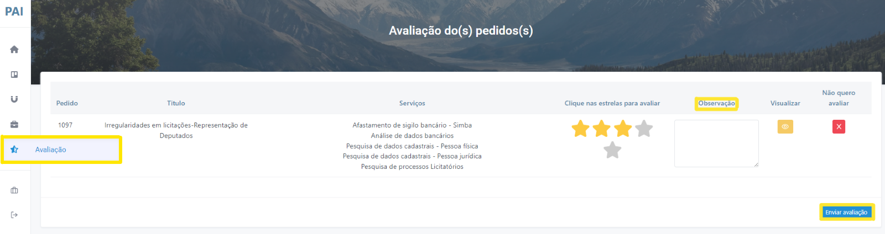

# Avaliar pedido

Permite ao membro avaliar os pedidos que já foram concluídos. Caso a avaliação seja igual ou inferior a 3 estrelas, o sistema solicitará que o membro discorra acerca das motivações que resultaram a baixa avaliação (Figura 36).

*Figura 36 - Avaliação dos pedidos*.   
